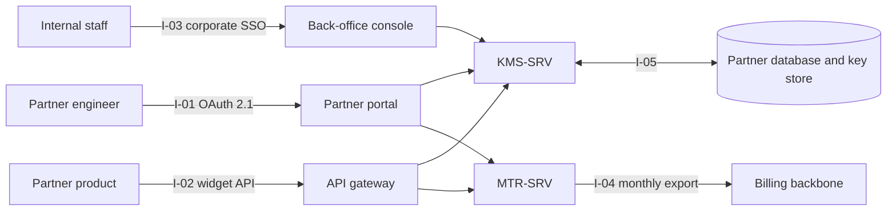
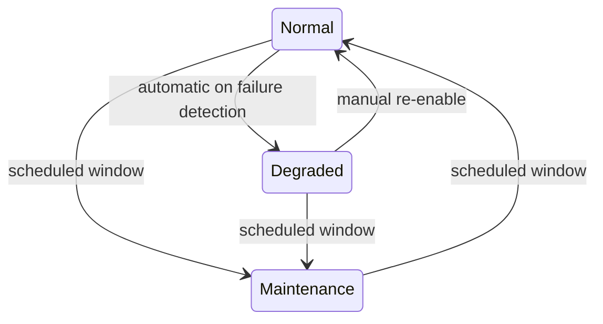

# System Requirements Specification: Example Widget Platform

## System Purpose

The Example Widget Platform (EWP) replaces the manual, e-mail-driven
partner onboarding process with a self-service system that provisions
partner accounts, manages the full API key lifecycle (issue, rotate,
revoke, expire) under a security-review gate, and meters API usage for
the billing hand-off — reducing onboarding from more than six weeks to
five business days and consolidating three legacy billing systems into
one.

## System Scope

- The system is named **Example Widget Platform** (EWP).
- Needs-analysis result: partner API onboarding takes more than six
  weeks of manual handling. The EWP onboards partners, runs the key
  lifecycle, and meters usage; it will **not** process payments
  (payment processor), manage legal contracts (Developer Relations), or
  build partners' products.
- Application and top-level objectives: a web portal for partners, a
  back-office console for internal staff, and two backing services
  (key management, metering) — delivering the three business KPIs of
  five-day onboarding, 50 partner integrations per quarter, and 50%
  fewer support tickets.

## Business Context and Goals

### Business Context

The partner business grew from a handful of integrations to a target of
50 per quarter, but onboarding still runs over e-mail: a partner sends
a request, Developer Relations validates it by hand, security review
happens in threads, and keys are issued manually — six weeks or more
end to end. Three legacy billing systems hold the metering data, and
their export formats differ, so the monthly hand-off to the payment
processor is assembled by hand. Support ticket volume scales with
onboarding volume, most of it "where is my key" status chasing.

### Goals

- GOL 0e15c5de-4ac9-4279-aa75-53249a3e43e4: Reduce Partner Integration
  Onboarding Time

  Ties the platform to a measurable business KPI: reduces onboarding
  time for new partner integrations from 6+ weeks to five business
  days.

- GOL 6761c7d8-59b9-4589-a2b2-0596ea460d61: Consolidate Legacy Billing
  Systems

  Justifies replacing three legacy billing systems with one
  consolidated platform — the "existing system being replaced"
  rationale the CONOPS components call for.

### Problem Statement

- PRB 7166b565-ddb2-4a91-924c-d36d0e02d7aa: Partner API Onboarding
  Takes Too Long

  Quantifies the pain point the goals above respond to: partner API
  onboarding takes 6+ weeks of manual handling, and support ticket
  volume grows with it.

## Stakeholder Needs and Elicitation

- QA c79bc330-6795-4dd3-9b79-c0936d4ae7f9: Partner Integration Team
  Requirements Interview

  Surfaces the top 5 pain points prioritized in the Partner
  Integration Team interview — the direct input to the Functional and
  Interaction Capability requirements below.

## Operational Concept and Scenarios

- UC 88ed67cd-0b3b-4846-a827-530c12695936: Partner Registers and
  Activates a New API Key

  The primary end-to-end scenario driving most of the functional
  requirements below: partner registers and activates a new API key.

- UC b3b37a97-36ca-41c1-9545-2355f5d07c31: Support Agent Revokes a
  Compromised API Key

  The exception-path scenario for the security requirements below:
  support agent revokes a compromised API key.

## Decisions

- DEC 60b1e331-4fe4-4d41-8c50-d0bd6227c472: Use an API Gateway for Key
  Issuance and Revocation

  Use an API gateway for key issuance and revocation — chosen to meet
  the sub-2s issuance requirement without duplicating gateway logic
  per service.

- DEC 365bcab7-b086-4205-84f9-eb1654ff8410: Rate-Limit Key Issuance
  Per Partner

  Rate-limit key issuance per partner, not globally — an operational
  decision kept in `dec` rather than a full ADR.

## Risks

- RSK c1b33b41-d976-4191-a2c5-6f3c09441eb3: Partner-Side API Key
  Leakage

  Partner-side key leakage via insecure storage. Initial: Probability
  3 / Impact 4 (High); mitigated by the revocation-within-1s
  requirement below; Residual: Probability 2 / Impact 4 (Medium) —
  Strategy: reduce.

- RSK 8b3d7f2a-6e1c-4a9f-b4d8-2c5e9f0a7d31: Billing Export Format
  Drift During Dual Run

  The 6-month dual run against the legacy billing systems risks format
  drift between the new and legacy exports. Initial: Probability 2 /
  Impact 3 (Medium); mitigated by the fixed export-format requirement
  and the 13-month retention below; Residual: Probability 1 / Impact 3
  (Low) — Strategy: reduce.

## Assumptions and Dependencies

Assumptions to take into account when allocating and deriving
lower-level requirements:

- **A-01** The global partner database exists and keeps its current
  availability (the master-data interface below depends on it).
- **A-02** Partner identity providers support OAuth 2.1; partners
  without it use the portal's hosted identity.
- **A-03** The cloud hosting provider offers key-management and
  container services in both operating regions.

Dependencies:

- **D-01** The billing-backbone consolidation completes before MVP —
  the monthly export format is defined against the new backbone.
- **D-02** Lower-level derivation: KMS-SRV carries the key-lifecycle
  and key-security requirements (specified in the companion SRS for
  the Key Issuance Service); MTR-SRV carries the metering and
  usage-export requirements.

## System Overview

### System Context

The EWP comprises four technical elements — partner portal,
back-office console, key management service (KMS-SRV), metering
service (MTR-SRV) — and two human elements — partner engineers and
internal staff (support agents, security reviewers, Developer
Relations managers, billing analysts). Partners reach the portal over
HTTPS; internal staff reach the console over corporate SSO; portal and
console both call KMS-SRV and MTR-SRV; KMS-SRV reads and writes the
global partner database and the key store; MTR-SRV consumes API-call
events and exports the monthly billing file to the payment processor.

Interfaces crossing the EWP boundary:

- **I-01 Partner identity**: OAuth 2.1 from the partner's identity
  provider into the portal (inbound).
- **I-02 Partner widget API**: the partner product calls the EWP
  widget endpoints with its issued key (inbound; metered).
- **I-03 Internal SSO**: corporate SSO into the console (inbound).
- **I-04 Billing hand-off**: monthly usage export to the payment
  processor (outbound).
- **I-05 Partner master data**: read/append against the global
  partner database (both directions).
- **I-06 Cloud hosting**: the EWP runs inside the cloud hosting
  provider's tenancy (availability dependency only).

### System Functions

- **F-1 Partner onboarding**: registration, validation, review
  routing, provisioning, activation.
- **F-2 Key lifecycle**: issue, rotate, revoke, expire — each a
  single auditable action under the security-review gate.
- **F-3 Usage metering**: per-partner, per-API-call event capture and
  monthly export.
- **F-4 Stakeholder views**: partner usage report, SLA dashboard,
  audit trail, KPI dashboard.
- **Conditions/constraints**: F-2 operates only in normal and
  degraded modes; F-3 must continue during maintenance.

### User Characteristics

- **Partner engineers** (external, any location, standard browsers):
  thousands of individuals; technical; use the portal briefly per
  onboarding and rarely thereafter; no prior training.
- **Support agents** (internal, desk, browser): ~15; use the console
  continuously, under incident time pressure; no engineering
  background.
- **Security reviewers** (internal, desk, browser): ~5; use the review
  queue daily; skilled, but the console must still make the evidence
  fields explicit.
- **Developer Relations managers / billing analysts / executives**
  (internal, browser): ~10 combined; dashboard-only users.

### System Integration

Integration sequence: KMS-SRV first (it sits on the key-operation
critical path and gates F-2), MTR-SRV in parallel (F-3 has no hard
dependency on KMS-SRV beyond the partner identifier), portal and
console last, against a staging deployment of both services. The only
cross-organization integration point is I-04: the billing-backbone
dual run (6 months) starts with the MVP release and is the gating
integration milestone. Staging-region interoperability tests cover
I-01 (a reference partner identity provider) and I-04 (a reference
billing backbone) before go-live.

## System Modes and States

- **Normal**: all functions F-1 … F-4 available; all performance
  requirements apply.
- **Degraded**: portal read-only; console key operations and metering
  continue; mode banner shown in portal and console; entry condition
  is platform-side failure, exit is manual re-enable by Platform
  Engineering.
- **Maintenance**: announced window; no key operations; metering
  continues; portal and console show the window.
- Transitions: normal → degraded (automatic on failure detection),
  degraded → normal (manual), any → maintenance (scheduled),
  maintenance → normal (scheduled). The transition diagram is in the
  Appendix.

## Requirements

### Functional Suitability

- REQ a3f8c2d1-7b4e-4d9a-b6c0-91e5f2a8d734: Partner Registration
  Validation

  The system shall validate a partner registration submission
  (company data, plan tier, technical contact) and reject incomplete
  submissions with field-level feedback.

- REQ c94e1b7a-2d8f-4a3e-8b5c-6f0a9d2e7c41: API Key Rotation with
  Grace Period

  The system shall support rotating a key: a new key is issued, the
  old key stays valid for a 24 h grace period, then expires.

- REQ e57b0c3d-9a2f-4e8b-b1d6-4c8f2a0e9d73: Monthly Partner Usage
  Export

  The system shall produce the monthly per-partner usage export in the
  billing-backbone format.

### Performance Efficiency

- REQ 64265c7a-144c-46d5-9bd7-13750254bc54: API Key Issuance Latency

  System shall issue an API key within 2 s of registration
  acceptance; drives scenario UC 88ed67cd-0b3b-4846-a827-530c12695936.

- REQ 779b8275-beb8-4428-9e90-962929a42af7: API Key Revocation
  Latency

  System shall support revoking a key within 1 s of the agent's
  action; drives scenario UC b3b37a97-36ca-41c1-9545-2355f5d07c31.

- REQ f2a9d4e7-6c3b-4f1a-9e08-3b7c5d1a2e86: Metering Throughput

  Metering shall sustain 5,000 API-call events/s with 20,000
  events/s peaks without event loss, in normal mode.

### Compatibility

- REQ 4d8b6e2a-1f5c-4a9d-b3e7-0c2a8f4d6b19: Stateless Widget API over
  HTTPS/JSON

  The widget API shall be stateless HTTPS/JSON, authenticated by the
  issued key; key validation shall respond within 100 ms at the 99th
  percentile.

- REQ 8c3f7a1e-5d9b-4e6a-a2c4-7e0b3f8d1c56: Billing Backbone Export
  Format Compatibility

  The monthly usage export shall use the fixed billing-backbone
  schema; format changes require a version bump and a 6-month dual
  run.

### Interaction Capability

- REQ 1e5a9c3f-8b2d-4f7a-c4e6-2d9b5a0f7e31: Self-Service Onboarding
  Without Support

  ≥ 90% of partners shall complete registration-to-activation without
  contacting support, measured quarterly.

- REQ 6f0d2b8e-4a7c-4e1f-b9d3-8c5a2f6e0d47: Revocation Confirmation
  Shows Recent Usage

  The revocation workflow shall show the key's recent usage before the
  confirmation; the only destructive action requires explicit
  confirmation and is immediately visible in the audit trail.

### Reliability

- REQ 3a7e5c1f-9d2b-4f8a-a6c0-1e4b8d2f5a93: Portal Monthly
  Availability

  The portal shall be available 99.5% per calendar month in normal
  mode; KMS-SRV 99.9% per calendar month — it sits on the
  key-operation critical path.

- REQ b4c8e2a6-7f1d-4b3e-9a5c-0d7f3e8a2c64: No Metering Event Loss

  MTR-SRV shall lose no metering events in normal mode under the
  metering-throughput requirement; event persistence is durable-write
  before acknowledgment.

### Security

- REQ 7d2f9a4c-3e8b-4c5f-b1a7-6f0c4e9d2a85: Key Material Stored in
  Cloud KMS Only

  Keys shall be generated and stored in the cloud key management
  service; no key material in application databases in plaintext.

- REQ 0e6b3d8f-5a2c-4f9e-a8c1-3e7d0f5b9a42: Tamper-Evident Key
  Lifecycle Audit Log

  Every key lifecycle event shall be written to a tamper-evident audit
  log (append-only, hash-chained).

### Maintainability

- REQ 5c1a8f3e-2d6b-4e7a-c9f4-8a3e5d0f7b21: Mean Time to Repair Within
  15 Minutes

  Mean time to repair for a failed platform component shall be ≤ 15
  min using the runbook; no component shall require a single named
  engineer.

- REQ d8f4a2c6-1e9b-4d3f-b7a0-5c2e8f4a9d63: Runtime Configuration
  Without Code Release

  All configuration (tier quotas, rate limits, mode flags) shall be
  changeable via the console or infrastructure-as-code without a code
  release.

### Flexibility

- REQ 2b9d6e1f-4c7a-4f8b-a3d5-9e0c2f6a8d47: Linear Horizontal Scaling

  The platform shall scale horizontally: adding container replicas
  shall raise capacity linearly up to 10× the baseline without
  redesign.

- REQ 9a4c7e2d-8b1f-4a6c-b5e9-3f7d0a2c5e81: Third Region by
  Configuration Only

  A third region shall be addable by configuration and deployment
  only — no code change.

### Safety

- REQ 4f8b2d6a-1c5e-4b9f-a8d2-7e3c9f0a6b45: No Unattended Bulk
  Destructive Operations

  No bulk key revocation or partner data deletion shall run without
  explicit, per-item, logged human confirmation — harm avoidance for
  the high-error-sensitivity revocation area.

## Other Characteristics

### Physical Characteristics

- REQ c1e5a9d3-7f2b-4c8a-b6e0-4a8d2f6c9e17: Regional Co-Location for
  Data Residency

  The EWP has no hardware of its own; each hub's containers run in
  that region's availability zones, so partner data stays in-region.

### Environmental Conditions

- REQ 6a0f4c8e-2d9b-4e5f-a1c7-8b3d5f0e9a24: Survival of Single
  Availability-Zone Loss

  The platform shall survive the loss of a single cloud
  availability zone without data loss, beyond the degraded-mode
  definition.

### Information Management

- REQ e8d2b6f4-1a3c-4e9b-b7d5-0f4a8c2e6d19: Metering Event Retention
  Thirteen Months

  Metering events shall be retained 13 months, then archived
  read-only for 12 more.

- REQ 3c7e1a5f-8d2b-4f4a-c9e6-5a0b7d3f8e21: Nightly Backup With
  Bounded RPO and RTO

  The key store and partner database shall be backed up nightly;
  RPO ≤ 24 h, RTO ≤ 4 h.

### Policy and Regulation

- REQ b19c5446-4e11-466e-b517-7763c586f63e: OAuth 2.1 Compliance

- REQ 7e2a6c4f-9b1d-4e8f-a3c5-1d8b4e0f7a39: In-Region Storage of EU
  Partner Data

  The platform shall store and process EU-region partner data
  in-region, per the data-protection law of each operating region.

### System Life Cycle Sustainment

- REQ a5f9d3b7-2c6e-4a1f-b8d4-7e0c5a9f3d68: Certified Support Cadre
  Before Go-Live

  2 support agents per hub shall be certified on the console runbooks
  before go-live, with a refresher each increment.

### Packaging, Handling, Shipping and Transportation

- REQ f6b1e8a4-5c2d-4f9e-a0b3-9d7c1e5f8a26: Signed Immutable Release
  Artifacts

  Release artifacts (container images) shall be signed, stored in the
  private registry, and immutable per version; deployment is the only
  transport step.

## Verification

- VCR ee8672f3-af06-4f53-bc2a-80b5a581399b: API Key Issuance Latency
  Verification

  Verifies REQ 64265c7a-144c-46d5-9bd7-13750254bc54 above via a
  `Test`-method acceptance criterion measuring issuance time against
  the 2 s threshold. Full coverage.

- VCR 4584b5e0-6fe2-47e1-ab7d-0c67835e7df0: API Key Revocation
  Latency Verification

  Verifies REQ 779b8275-beb8-4428-9e90-962929a42af7 above via a
  `Test`-method acceptance criterion measuring revocation time against
  the 1 s threshold. Full coverage.

- VCR 5e9c3a7f-1b4d-4e8a-c6f2-0a5d8e3b9c47: Monthly Usage Export
  Format Verification

  Verifies REQ e57b0c3d-9a2f-4e8b-b1d6-4c8f2a0e9d73 and REQ
  8c3f7a1e-5d9b-4e6a-a2c4-7e0b3f8d1c56 above via an `Inspection`-method
  acceptance criterion comparing the export against the
  billing-backbone schema. Partial coverage (dual-run evidence
  pending).

## References

- ISO/IEC/IEEE 29148:2018, *Systems and software engineering — Life
  cycle processes — Requirements engineering*
- ISO/IEC 25010:2023, *Systems and software engineering — Systems and
  software Quality Requirements and Evaluation (SQuaRE) — System and
  software quality models*
- ISO/IEC/IEEE 24765:2017, *Systems and software engineering —
  Vocabulary*
- OAuth 2.1 (draft-ietf-oauth-v2-1)
- Billing Backbone Interface Specification v3.1 (internal)

## More Information

This specification covers the MVP only. Self-service key rotation for
partners (today a console-only action) and a partner-facing usage API
are anticipated phase-2 work and are deliberately not requirements
here; they will be added in a later revision of this document rather
than amended into the MVP scope.

## Appendix

Mode-transition diagram (see System Modes and States above):

Worked example — key rotation timeline (REQ c94e1b7a-2d8f-4a3e-8b5c-
6f0a9d2e7c41):

- t=0: rotation action issued; new key valid immediately.
- t=0 … t+24 h: both keys valid (grace period); validation prefers
  the new key.
- t+24 h: old key expires; a request with the old key fails
  validation immediately.
- Both transitions are written to the audit log (REQ 0e6b3d8f-
  5a2c-4f9e-a8c1-3e7d0f5b9a42).

## Definitions and Acronyms

- **API** — Application Programming Interface
- **EWP** — Example Widget Platform
- **KMS-SRV** — Key Management Service
- **MTR-SRV** — Metering Service
- **MVP** — Minimum Viable Product
- **RPO** — Recovery Point Objective
- **RTO** — Recovery Time Objective
- **SLA** — Service Level Agreement
- **SSO** — Single Sign-On

## Updates

### 2026-09-14 — Added Security Requirements

Two Security requirements added (see Security under Requirements
above) after the partner security review flagged unencrypted key
storage; System Context diagram updated to show the KMS boundary.

### 2026-08-30 — Initial draft created

Initial system specification drafted from the linked Goals/Problem
Statement/Scenarios; no Requirements or Decisions cross-referenced
yet.
