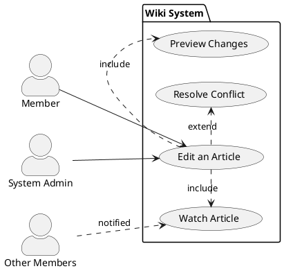
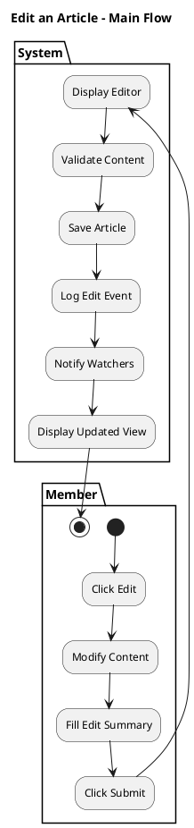

# PlantUML Examples: Generated from Markdown Use Cases

## 1. Use Case Diagram (High-level view of actors and use cases)

This diagram shows the actors and the use cases they interact with, plus any include/extend relationships.



**Key elements extracted from markdown:**
- **Actors**: Extracted from "Actors" and "Stakeholders" fields
- **Use Cases**: Main use case (title) + alternatives that are sub-flows (include) or conditional (extend)
- **Relationships**: 
  - Basic: `-->` (actor initiates)
  - Include: `.>` (required sub-flow like Preview)
  - Extend: `<|--` (optional variation like Conflict)

---

## 2. Activity Diagram (Detailed flow showing actor vs. system interaction)

This diagram shows the step-by-step flow with swimlanes for Member (actor) and System.

```plantuml
@startuml
title Edit an Article - Activity Flow

skinparam activityShape box
skinparam defaultFontSize 12

partition Member {
  (*) --> "Click Edit"
  --> "Modify Content" as content
  --> {decision} preview?
  --> [no] "Fill Edit Summary" as summary
  preview? --> [yes] "Click Show Preview" as show_preview
  show_preview --> content
}

partition System {
  --> "Display Editor\nwith Content" as editor
  --> decision1
  content --> decision1
  decision1 --> [if preview] "Render Preview\nShow Changes"
  decision1 --> [if no preview] "Validate\nCheck for Conflicts"
  editor --> decision1
  "Render Preview\nShow Changes" --> summary
  summary --> "Validate\nCheck for Conflicts" as validate
}

partition Member {
  validate --> {decision2} summary_filled?
}

partition System {
  summary_filled? --> [no] "Error:\nEdit Summary Required" as error
  error --> summary
  summary_filled? --> [yes] "Check for Edit Conflict"
}

partition Member {
  "Check for Edit Conflict" --> {decision3} conflict?
}

partition System {
  conflict? --> [yes] "Notify: Conflict\nOffer Options"
  conflict? --> [no] "Save Article\nLog Edit Event\nNotify Watchers" as save
  "Notify: Conflict\nOffer Options" --> [if merge] "Resolve Conflict"
  "Resolve Conflict" --> content
  save --> "Display Updated\nArticle View"
}

partition Member {
  "Display Updated\nArticle View" --> (*)
}

@enduml
```

**Key elements extracted from markdown:**
- **Swimlanes (Partitions)**: Extracted from actor names at the start of each numbered step (regex: `^\d+\.\s+([A-Za-z]+)\s+`)
- **Actions**: Each numbered step becomes a transition, with actor name determining the swimlane
- **Branches**: Alternative flows (5a, 5b, 9a) become decision diamonds with conditions
- **Flow**: Numbered steps map to sequential actions, step references determine where branches rejoin

---

## Alternative: Simpler Activity Diagram (Main Flow Only)

If you want a simpler diagram showing just the happy path:



---

## Code Generation Strategy

To **generate these from markdown**, you would:

### For Use Case Diagram
1. Parse **Actors** field → `actor` declarations
2. Parse **Title** → main `usecase` declaration
3. Parse **Alternative Flows** → sub-usecases
   - Flows that ARE sub-flows (Preview, Compare) → `.>` (include)
   - Flows that are OPTIONAL/ERROR paths (Conflict, Timeout) → `<|--` (extend)
4. Create associations between actors and main use case
5. Add include/extend relationships for alternatives

### For Activity Diagram
1. Parse **Main Success Scenario** numbered list
   - Regex: `^\d+\.\s+([A-Za-z]+)\s+(.+)$` → Extract actor name and action
   - Actor name at start of sentence determines swimlane (partition)
   - Action text becomes the activity label
2. Create swimlanes/partitions for each unique actor found
3. Connect steps sequentially with arrows
4. Extract **Trigger** from Metadata → starting point
5. Parse **Alternative Flows** → decision diamonds with conditions
   - Step reference (5a, 9a) means: branch after step number
   - Condition becomes the diamond decision label
6. Map **Success Guarantees** → final state notes

---

## Benefits of This Approach

✅ **Markdown is authoritative** — single source of truth  
✅ **Both diagrams generated** — use case (high-level) + activity (detailed flow)  
✅ **Minimal duplication** — one markdown file → both diagrams  
✅ **PlantUML-friendly structure** — actors & table naturally map to swimlanes  
✅ **Parseable by code** — clear, structured sections for regex/parsing  
✅ **Human-readable** — flows are plain English sentences  
✅ **Agile-compatible** — lightweight metadata sections, not verbose Cockburn template
