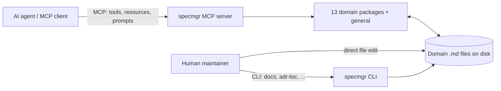

# System Requirements Specification: biz.dfch.SpecMgr

## System Purpose

biz.dfch.SpecMgr exists to be an artifact manager for system specifications: an MCP server (with an optional companion CLI) that AI agents and human maintainers use to create, read, list, update, and validate structured specification artifacts -- Architecture Decision Records, Decisions, Features, Goals, Problem Statements, Question-and-Answer interviews, Requirements, Risks, Standard Operating Procedures, System Requirements Specifications, Task Lists, Use Cases, and Verification Case Records -- instead of hand-editing free-form markdown or maintaining specification content in a separate, disconnected tool. Its domain-first architecture keeps every document type's schema, parser, and MCP tools/resources/prompts co-located in its own package, so that specification work stays machine-readable, consistently structured, and directly actionable by the agents performing it, while still being safe for a human to hand-edit the underlying `.md` files between tool calls.

## System Scope

The system provides thirteen document-type domains (adr, req, uc, tsk, qa, prb, gol, rsk, dec, sop, feat, vcr, sysrs) plus one cross-cutting general package of generic, type-dispatched tools (update, set_status, set_classification, delete, mdformat) and shared resources (specmgr version, iso25010, dtais, rasci), all exposed over the Model Context Protocol (MCP) as tools, resources, and prompts, plus an optional Typer-based CLI (specmgr) for documentation generation and cross-cutting utilities. Every document type's `.md` files on disk are the sole source of truth -- the server holds no in-memory cache and re-reads/re-parses/re-writes on every call, so hand-editing between tool calls is always safe. The system does not manage tickets, sprints, or project schedules (it is not a project-management/ticketing system); it does not generate application source code from specifications (it is not a code-generation tool); and it has no graphical user interface -- its only surfaces are MCP tools/resources/prompts and the specmgr CLI's documentation-generation commands. It also does not yet enforce specification freshness or validity in CI/pre-commit, a known, documented gap.

## Business Context and Goals

### Business Context

Specification artifacts (decisions, requirements, goals, risks, use cases, verification records, and the System Requirements Specifications that aggregate them) are normally maintained as free-form prose in wikis, issue trackers, or hand-formatted markdown, which agents and tools can only consume unreliably. biz.dfch.SpecMgr's founding engineering-practice rationale is to make every one of those artifact types schema-validated, individually addressable by a stable id, and safely readable/writable by both AI agents and humans, so that higher-level documents (most directly, a sysrs document like this one) can aggregate lower-level artifacts by reference instead of by copy-paste duplication.

### Goals

- GOL 08666592-a2d2-4309-95c6-3c94248ca342: AI-Agent-Native Specification Artifact Management

  States the system's founding, organization-wide purpose: an MCP server that AI agents and other MCP clients use to create, read, list, update, and validate every one of the thirteen specification artifact types, so specification work stays machine-readable and consistently structured for the agents performing it.

- GOL b663528e-08c5-426b-9f20-32192c0a3bdb: Cross-Referenceable, Non-Duplicating Specification Artifacts

  States the design intent underlying the sysrs domain specifically, and this document as its concrete instance: every artifact type is schema-validated and addressable by a stable id precisely so that a System Requirements Specification can aggregate existing goal, requirement, decision, and other artifacts by cross-reference rather than by duplicating their content.

## Decisions

- ADR ece4554b-725c-4f76-bc04-5d2b760363d2: Organize the codebase by document-type domain: domain-first hierarchy for tools/prompts/resources, shared versioned models

  The core organizing principle behind every domain package this specification's Requirements and Decisions sections cross-reference: each document type owns its own tools, prompts, resources, and schema, co-located rather than scattered across interface-layer-first packages.

- ADR 33c5ab08-ff58-4c73-8c32-23abaf3838e3: Filesystem is the sole source of truth: no in-memory id-to-document cache

  Establishes that every domain's .md files, not any in-memory index, are authoritative -- the invariant the System Scope section above relies on when describing hand-editing safety.

- ADR 8cf940c5-3100-485c-a12d-14b59b631712: id/filename/addressing scheme: server-generated UUID, {id}-{slug}.md, directory-scan resolution

  Fixes how every cross-reference bullet in this document resolves to a real file: a server-generated UUID id plus a fresh directory scan, not a cached index.

- ADR 832cd6c1-ef8a-4bfc-990e-a610823f61ae: Generic heading-mapped markdown-to-Pydantic parsing with declarative Heading metadata and opt-in constraints

  The shared parser and renderer infrastructure that every domain's schema besides ADR itself is built on, including the req, gol, and sysrs schemas this document depends on.

- ADR 36905d5b-8057-4294-8665-c7eed5534db0: Consolidate whole-body update and status-change tools into generic type-dispatched tools

  Fixes the convention this document's own regeneration workflow relies on: whole-body and line-range updates and status changes go through the generic update and set_status tools with an explicit type parameter, not per-domain tools.

- ADR ec9f5262-9912-49d0-903f-fcfb54f28c13: Expose list resources as paged MCP tools, not resources

  Fixes how an agent discovers existing cross-reference candidates before drafting or refreshing a sysrs document like this one, rather than reading an unbounded resource.

- ADR ddfb1109-422d-4507-8dbc-dc5e4bec9614: Expose id-based REQ document reads as a tool (get_req), not a resource

  Fixes the precedent every later domain, including sysrs itself, follows for id-based reads: a get_&lt;d&gt; tool, not a resource -- the same precedent this document's own get_sysrs follows.

- ADR e369ee2e-3353-4f92-991c-6367d76d832e: Organize development artifacts in `.specmgr` with feature-driven work units

  Fixes the .specmgr/feat/feat-NNN-slug/README.md convention this very specification was produced under, feat-84-specmgr-sysrs, distinct from the published, generated documentation under docs/.

## Assumptions and Dependencies

Assumptions to take into account when allocating and deriving lower-level requirements:

- Python 3.11 or newer is available in the runtime environment (the project's requires-python floor; 3.11 through 3.13 are CI-tested).
- The uv package manager is used for dependency management and running commands.
- An MCP-capable client (e.g. an AI coding agent, or the MCP Inspector) is available to invoke the server's tools, resources, and prompts; the CLI alone does not expose document-management operations.
- The filesystem underlying each domain's base directory (configurable per domain via its own SPECMGR_*_DIR environment variable, or the shared SPECMGR_DOCS_DIR) is available, writable, and not concurrently modified by an incompatible process.

Dependencies:

- The eleven flat-file whole-body domains and the feat domain depend on the cross-cutting general package's generic update, set_status, set_classification, and delete tools for their non-create mutation operations -- they do not each define their own equivalents.
- Every domain except adr depends on the shared generic markdown parser and renderer infrastructure for its schema.

## System Overview

### System Context

biz.dfch.SpecMgr's internal elements are: the MCP server process, the optional CLI, and the thirteen document-type domain packages plus the cross-cutting general package, each contributing its own tools, resources, and prompts to the server's registration at import time. The external actor is any MCP client -- an AI coding agent, the MCP Inspector, or another MCP-capable host -- that connects to the server over stdio, sse, or streamable-http and invokes its tools, resources, and prompts; a human maintainer is a second, less frequent external actor, interacting either through an MCP client on their behalf or by hand-editing the underlying .md files directly, which is safe since the filesystem is always re-read.

### System Functions

- Per-domain CRUD and validation: each of the thirteen document-type domains provides create, read (by id, and a paged list), and validate operations for its own schema-defined document type, plus domain-specific mutation tools where the domain warrants them, e.g. ADR's update_section and option tools, or FEAT's set_feat_id.
- Generic cross-domain dispatch: the general package's update, set_status, set_classification, and delete tools provide whole-body/line-range update, status change, classification change, and deletion uniformly across the twelve whole-body domains, and adr as a thirteenth for set_status, each taking an explicit type parameter rather than requiring a dedicated per-domain tool.
- Cross-cutting utilities: mdformat, which formats markdown while preserving frontmatter, and shared resources (version, iso25010, dtais, rasci) support every domain without being specific to any one of them.
- Documentation generation: the CLI's docs, adr-toc, mcp-docs, and unused-code commands regenerate the project's own published documentation and dead-code reports from source.

### User Characteristics

- AI agents, the primary user class: connect as MCP clients, invoke tools, resources, and prompts to create, read, and refine specification artifacts on a human's behalf; no persistent identity beyond the MCP session.
- Human developers and maintainers: use an MCP client themselves, e.g. an interactive coding agent session, or hand-edit .md files directly; also run the CLI's documentation-generation commands and the pre-commit and CI pipeline.

### System Integration

A new document-type domain is added by creating a new top-level package following the domain-first convention: its own tools, resources, prompts, and schema, one dispatch entry per generic tool in the general package (update's and set_status's type parameter, delete's adapter), and a raw parameter on its get_&lt;d&gt; tool. The new domain's package must then be added to server.py's final import line, which imports every domain package purely for the side effect of running its tool, resource, and prompt registration decorators -- omitting that import means the new domain's tools, resources, and prompts silently never register. The reserved-but-not-yet-built ac (Acceptance Criteria) domain is the next domain expected to follow this exact sequence.

## Requirements

### Functional Suitability

- REQ 678319da-f8e6-4f65-8f98-1096024012af: Architecture Decision Record Document Management

  Covers the adr domain's create, read, update-frontmatter, update-section, option-management, status-change, and validate operations for MADR-style decision records.

- REQ 64065cad-bb84-45c4-9e18-b2a8c5ce6865: Requirement Document Management

  Covers the req domain's create, read, list, and validate operations for individual, ISO/IEC 25010:2023-categorized requirement statements -- the artifact type this specification's own Requirements section cross-references.

- REQ 594afce9-7166-47b2-8e8f-788b9ed68c8e: Use Case Document Management

  Covers the uc domain's create, read, list, and validate operations for operational-scenario documents.

- REQ c097fcb4-9bbd-41f8-b774-b2afdcb8ecb9: Task List Document Management

  Covers the tsk domain's create, read, list, and validate operations for implementation checklists, plus its dedicated implement_task prompt.

- REQ 152d608b-ea4c-463b-8183-33332fb41e50: Requirements-Elicitation Question and Answer Document Management

  Covers the qa domain's create, read, list, and validate operations for structured elicitation interviews.

- REQ f4180953-9f1b-45a5-8474-8d15a5872d49: Problem Statement Document Management

  Covers the prb domain's create, read, list, and validate operations for Six-Sigma-style 5W2H problem statements.

- REQ 7c0e56e2-3fa5-437e-b886-1be32b142292: Goal Document Management

  Covers the gol domain's create, read, list, and validate operations for high-level business goals -- the artifact type this specification's own Business Context and Goals section cross-references.

- REQ bb018715-f9e6-4ae6-830c-58e40162ac70: Risk Register Document Management

  Covers the rsk domain's create, read, list, and validate operations for risk-register entries with a 5x5 pre- and post-mitigation assessment.

- REQ 1b6975fb-f5c2-4a16-b9db-9f026b8e6912: General Decision Document Management

  Covers the dec domain's create, read, list, and validate operations for non-architecture-specific MADR-style decisions.

- REQ ccbf7ade-7d9e-4b2e-9868-0740bdc0e824: Feature Folder Document Management

  Covers the feat domain's create, read, list, and validate operations for the .specmgr/feat/&lt;id&gt;/README.md convention this very specification was produced under.

### Maintainability

- REQ 3bbe6a0e-038c-4abb-987c-79d4db8abd51: Standard Operating Procedure Document Management

  Covers the sop domain -- the first domain built dispatch-only from day one, reducing the number of per-domain tools that must be built and maintained as the system grows.

- REQ 10b78b36-abad-4bfe-9281-f75677ff7d09: Verification Case Record Document Management

  Covers the vcr domain's DTAIS-classified acceptance criteria that make a requirement's fulfillment objectively assessable -- the Testability sub-characteristic of Maintainability.

- REQ 26c37265-1a85-4b18-aada-c9e3db9574a8: System Requirements Specification Aggregator Document Management

  Covers the sysrs domain itself -- the artifact type this very document is an instance of.

- REQ bad7e9c7-f794-477b-b64f-ce04645c6ef3: Generic Cross-Domain Document Dispatch Tools

  Covers the general package's generic update, set_status, set_classification, and delete tools, which keep the tool surface from growing linearly with the number of document-type domains.

## References

- ISO/IEC/IEEE 29148:2018, Systems and software engineering -- Life cycle processes -- Requirements engineering
- ISO/IEC 25010:2023, Systems and software engineering -- Systems and software Quality Requirements and Evaluation (SQuaRE) -- System and software quality models
- This repository's AGENTS.md, for the domain-package inventory and architectural conventions
- This repository's README.md, for project purpose, installation, and MCP server usage

## More Information

This is a first-pass, retrospective System Requirements Specification (feat-84-specmgr-sysrs, GitHub issue #84), assembled from the existing codebase, AGENTS.md, and every .specmgr/feat/*/README.md rather than from a forward-looking requirements-elicitation exercise. Its Requirements section covers exactly the domain-package inventory documented in AGENTS.md's Status section as of this writing: only Functional Suitability and Maintainability currently have explicit REQ coverage, because the fourteen REQ documents backing this specification were themselves authored, one per domain package, specifically for this exercise. The other seven ISO/IEC 25010:2023 characteristics -- Performance Efficiency, Compatibility, Interaction Capability, Reliability, Security, Flexibility, and Safety -- are intentionally left empty in Requirements above, not omitted by oversight: no concrete, characteristic-specific requirement, such as a measured latency budget, a compatibility contract, or a security control, has been captured for this system yet. They are expected to be filled in by future feature work that captures such requirements explicitly, then added here via the regeneration workflow in feature feat-84-specmgr-sysrs's own Design Notes section.

Because this specification is retrospective, it also omits several optional sections entirely rather than leaving them as empty headings: Stakeholder Needs and Elicitation and the Problem Statement sub-section (no qa or prb document exists that is scoped to this specification itself -- the fourteen REQs' own sources are README.md and AGENTS.md, not an elicitation interview), Operational Concept and Scenarios (no uc document exists for the MCP server's own operation), Risks (no rsk document exists for this specification), Other Characteristics (no backing REQ exists for any of its six sub-headings), and Verification (no vcr document exists yet for any of the fourteen REQs above). Each omission is a documented, accepted gap, not an oversight.

## Definitions and Acronyms

- ADR -- Architecture Decision Record: a MADR-style decision record, deprecated in favor of DEC for new decisions but still actively managed for the existing accepted ADRs.
- DEC -- Decision: a general, non-architecture-specific MADR-style decision record.
- FEAT -- Feature: a .specmgr/feat/&lt;id&gt;/README.md feature-folder plan-and-progress document, such as the one that produced this specification.
- GOL -- Goal: a high-level business goal document that sits above individual requirements.
- MCP -- Model Context Protocol: the protocol this project's server exposes tools, resources, and prompts over.
- PRB -- Problem Statement: a Six-Sigma-style 5W2H problem statement document.
- QA -- Question and Answer: a requirements-elicitation interview document.
- REQ -- Requirement: an individual requirement statement categorized by ISO/IEC 25010:2023 characteristic.
- RSK -- Risk: a risk-register entry with a 5x5 probability/impact assessment and a TARA response strategy.
- SOP -- Standard Operating Procedure: a structured, step-by-step operational document with RASCI responsibility assignment.
- SYSRS -- System Requirements Specification: the aggregator document type this document is an instance of.
- TSK -- Task List: an implementation checklist derived from other documents.
- UC -- Use Case: an operational-scenario document.
- VCR -- Verification Case Record: a document recording how a single REQ or UC is verified.

## Updates

<!-- Newest entry first -- prepend new entries directly below this comment. -->

### 2026-09-03 - Created

Initial retrospective System Requirements Specification drafted from feat-84-specmgr-sysrs, GitHub issue #84, aggregating the two GOL and fourteen REQ documents created for this purpose plus eight already-accepted architecturally significant ADRs in the Decisions section; only Functional Suitability and Maintainability have explicit REQ coverage as of this writing, per the documented gap in More Information above.
