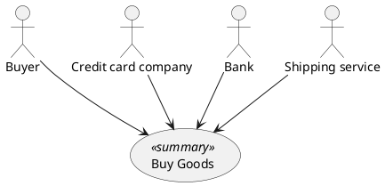

# UC → PlantUML Diagram Rulebook

The frozen mapping and validation spec for turning specmgr `uc` documents (use cases,
`uc/models/v2`) into PlantUML diagrams. This file is the content source of the
`specmgr://uc/plantuml` MCP resource and the single normative reference the renderers,
the structure checker, the validation chain, and the `generate_uc_sequence_diagram`
prompt implement against. Provenance: FEAT feat-185-uc-diagrams (GitHub issue #185),
Phase 100; the `plantuml/` package placement and the strict chain policy are decided by
the Phase 100 ADR cited in §8.

**Status: frozen.** A change to any rule below is a spec change — revise this file, the
feature plan, and (where it reverses a frozen decision) the ADR. Never reinterpret a
rule locally in a renderer, checker, or prompt.

## 1. Overview

Three diagram artifacts:

1. **Per-UC usecase diagram** (`render_uc_diagram`) — one `usecase` node (title + level
   stereotype), one `actor` node per distinct cleaned actor label, plain associations.
   Fully deterministic.
2. **Package usecase diagram** (`render_use_case_package`) — one `usecase` node per
   document in the package, the deduplicated union of all actors, and
   `<<include>>` / `<<extend>>` / superordinate edges from `Related Use Cases`.
   Fully deterministic; unresolvable references become notes, never failures.
3. **Sequence skeleton** (`render_uc_sequence_skeleton`) — participants, trigger, all
   notes, the `alt` fragment structure, and every message whose lead text starts with a
   participant label are deterministic; messages leading with *no* participant label are
   emitted as `UNATTRIBUTED` markers (§2.9.4) for the agent to resolve in the prompt
   flow (Phase 120). The fully attributed result is **agent-owned** and is never
   CLI-reproducible.

Everything a UC document contains is either mapped by a rule in §2 or explicitly ignored
by the closed list in §2.12. Nothing else renders.

## 2. Mapping spec (frozen)

### 2.1 Actor and participant label cleaning

Actor fields are free descriptive text, not clean names (e.g. `Credit card company
(for payment processing)`). The cleaned label is derived in this priority order (port of
the v1 renderer's `_actor_label`, `src/biz/dfch/specmgr/uc/models/v1/uc_diagram.py`):

1. the content of the **first double-quoted substring**, if the text contains one (e.g.
   `Company refers to buyer as "Buyer" (any agent...)` → `Buyer`) — this takes priority
   over a trailing parenthetical even when both are present;
2. otherwise, everything **before the first ` (`,** i.e. the trailing parenthetical is
   dropped (e.g. `Credit card company (for payment processing)` → `Credit card
   company`);
3. otherwise (no quotes, no parenthetical), the text **as-is, stripped**.

Actors **deduplicate by cleaned label**: primary actor first, then secondary actors in
document order; a label already seen is not emitted again. An actor whose cleaned label
equals the system label (§2.2) is a **single participant** — the first occurrence wins
its declaration slot (§2.9.1); the "system" receiver always resolves to that
participant.

### 2.2 System participant (from `Scope`)

The system participant label is derived from the `### Scope` section text: the **first
sentence** — the text up to the first `". "` (period + space) or, if none occurs, to the
end of the line — then the §2.1 cleaning applied to that sentence.

Worked example (the packaged example UC): the Scope text `Company (the system being
designed as a black box)` contains no `". "`, so the whole line is the first sentence;
cleaning drops the trailing parenthetical → system label `Company`.

### 2.3 Level normalisation

`### Level` is free text (no schema change). It is normalised **case-insensitively**
(trimmed) against the three canonical Cockburn spellings:

| Level text | Stereotype |
|---|---|
| `summary` | `<<summary>>` |
| `user goal` | `<<user goal>>` |
| `subfunction` | `<<subfunction>>` |

The stereotype is appended to the usecase node's declaration line (same line). Any
other (or empty) level text → **no stereotype, and never a failure**.

### 2.4 Label sanitisation and single-line escaping

Two character-level rules apply to all content the renderers emit:

- **Quote sanitisation (default, frozen):** an embedded `"` in content is emitted as
  the PlantUML escape `#quot;`. Applies to declaration labels, usecase titles, message
  text, note content lines, edge labels, and the `@startuml` title line. The structural
  double quotes PlantUML itself requires around a non-bare label in a declaration are
  added *after* sanitisation and remain real `"`.
- **Single-line escaping:** where content is emitted on a single PlantUML line — message
  text, marker-line text, declaration labels, usecase titles, edge labels — a literal
  newline in the content is emitted as the two-character sequence `\n` (PlantUML's
  in-message line break). Note content keeps literal newlines (multi-line notes are
  native).

### 2.5 Per-UC usecase diagram

`@startuml {title}` carries the UC's title (v1 precedent). Layout, in order:

1. `@startuml {title}` (title sanitised per §2.4, not quoted)
2. one blank line
3. the actor declarations: the distinct cleaned actor labels, primary actor first, then
   secondary actors in document order — `actor {label}` when the label is a bare
   identifier per the v1 `_BARE_ALIAS_PATTERN` (`^[A-Za-z_][A-Za-z0-9_]*$`), else
   `actor "{label}" as actor{N}` with `N` the 1-based position in this declaration order
4. the usecase node: `usecase "{title}" as uc` with the §2.3 stereotype appended on the
   same line when present (e.g. `usecase "{title}" as uc <<summary>>`); the alias is
   always `uc` (v1 precedent)
5. one blank line
6. one association per distinct actor, declaration order: `{actor-alias} --> uc` —
   `-->` is the v1 precedent for usecase associations; the `->`-only freeze of §2.9
   applies to sequence messages, not here
7. one blank line
8. `@enduml`

The source ends with exactly one trailing newline.

### 2.6 Reference rendering: the packaged "Buy Goods" example UC

The packaged example UC (`uc/data/uc_example.md`) renders its usecase diagram to
**exactly** this source — the frozen golden for `render_uc_diagram` (the trivial
usecase shape ships here, not in the later template):



Inputs exercised: primary actor `Buyer (any agent or computer acting for the customer)`
→ `Buyer` (bare → label-as-alias); secondaries `Credit card company (…)`, `Bank (…)`,
`Shipping service (…)` with the parentheticals dropped (non-bare → `actor2` / `actor4`
at positions 2 / 4); level `Summary` → `<<summary>>` (case-insensitive match); the
`Related Use Cases` references do not appear in the single-UC diagram at all (they are
package-edge input only, §2.8).

### 2.7 Package usecase diagram

Renders N parsed v2 UC documents (the package) to one diagram. Layout, in order:

1. `@startuml UC Package` — the title is this constant (frozen)
2. `left to right direction` — the frozen package layout
3. one blank line
4. the usecase nodes, one per document, in package order (the given `ids` order, or
   `list_uc` order when `ids=None`): `usecase "{title}" as {alias}` with the §2.3
   stereotype appended on the same line when present; the alias is the title itself
   when the title is a bare identifier per the v1 `_BARE_ALIAS_PATTERN`, else `uc{N}`
   with `N` the 1-based position in package order
5. the actor declarations: the **deduplicated union** of all documents' distinct
   cleaned actor labels, in order of first appearance (document order; within a
   document, primary actor then secondary actors in document order): `actor {label}` /
   `actor "{label}" as actor{N}` (`N` the 1-based position in the union)
6. one blank line
7. the associations, per document in package order, then per that document's distinct
   cleaned actors in its own declaration order: `{actor-alias} --> {usecase-alias}`
8. the package edges, per document in package order, per `Related Use Cases` bullet in
   document order, per reference within the bullet in text order (§2.8)
9. one blank line
10. `@enduml`

The source ends with exactly one trailing newline. Documents that exist but fail to
parse (including `list_uc` failed rows in `ids=None` mode) are skipped as nodes; any
reference to such a document takes the §2.8 unresolvable-note path.

### 2.8 Package edge rules

`Related Use Cases` bullets carry the relationship in free text; the authoring practice
is `Subordinate: X (…)`, `Superordinate: Y (…)`, with an explicit `<<extend>>` /
`Extension:` spelling the alternative. A bullet's references are the `UC <uuid>` tokens
the shared reference-tag vocabulary (`general/tools/_references`) recognises; a legacy
`UC-NNN` (non-uuid) token is unresolvable by definition.

**One edge per reference within a bullet** — the packaged example's single
`Subordinate:` bullet carrying three references yields three edges. The **inline label**
of a reference is derived by walking the bullet left to right: the label segment is the
bullet text from the end of the previous reference's closing `)` (or the start of the
bullet) up to the `(` immediately preceding the reference token (or the token's start
when the token is not parenthesised), cleaned by trimming, removing a leading
`{keyword}: ` (only for the first reference, when the bullet carries a recognised
keyword), removing a leading `,`, and trimming again:

`Subordinate: Create order (UC-015), Take payment by credit card (UC-044), Handle
returned goods (UC-105)` → labels `Create order`, `Take payment by credit card`,
`Handle returned goods`.

**Frozen edge kinds** — determined per bullet: (a) the bullet, after trimming, starts
(case-insensitively) with `subordinate:`, `superordinate:`, or `extension:` → that
keyword; (b) otherwise the bullet contains the literal `<<extend>>` (case-insensitive)
→ `extend`; (c) otherwise → `include` (the frozen default for a bullet carrying no
recognisable keyword):

| Bullet kind | Edge line (aliases, `{label}` omitted when empty) |
|---|---|
| `Subordinate:` or default | `{this} ..> {target} : <<include>> {label}` |
| `<<extend>>` / `Extension:` | `{target} ..> {this} : <<extend>> {label}` |
| `Superordinate:` | `{superordinate} ..> {this} : {label}` (no stereotype) |

**Emission condition (frozen):** an edge is emitted only when the reference resolves to
a document that (a) is on disk, (b) parses, and (c) is one of the package's documents —
all three edge kinds (the `Superordinate:` "both documents in the package" requirement
is this same check stated for that keyword). Anything else — legacy `UC-NNN`, missing on
disk, existing-but-broken (including `list_uc` failed rows in `ids=None` mode), or
resolvable but outside the package — emits **one deterministic note per reference**
instead of the edge:

`note bottom of {this-alias}: Unresolved UC reference: "{inline text}"`

where `{inline text}` is the label as derived above (sanitised per §2.4, wrapped in the
note's structural quotes; empty quotes when the label is empty). The render **never
fails** on a reference.

### 2.9 Sequence skeleton

The skeleton is deterministic except for the UNATTRIBUTED markers (§2.9.4). Layout, in
order — **no blank lines inside the step body** (items 6–7 run consecutively); one
blank line only where shown:

1. `@startuml {title}` (the UC's title, sanitised per §2.4, not quoted)
2. one blank line
3. the participant declarations (§2.9.1)
4. one blank line
5. the preconditions note (§2.9.6) + one blank line — when present
6. the trigger message or marker (§2.9.5), plus its continuation note when present
7. the steps 1..N in ordinal order, each:
   - the step's message line or UNATTRIBUTED marker line (§2.9.3, §2.9.4)
   - the step's continuation note (§2.9.6), when present
   - the step's sub-variation note (§2.9.6), when present (after the continuation
     note, when both exist)
   - each extension anchored at this step, in document order (§2.9.7)
8. one blank line
9. the final notes (§2.9.6): success end condition, then failed end condition, in
   document order — each when present
10. `@enduml`

The source ends with exactly one trailing newline.

**Note block format (frozen; the unanchored header amended 2026-10-05):**

    note left
      {content line, 2-space indented}
    end note

`note right` (message-attached) and `note left` (top/final/unanchored) share this shape; the
only difference is the header line. A blank line inside the note content is emitted as
a truly empty line. Top (preconditions) and final (end condition) notes are `note left`
blocks; all message-attached notes (continuation, sub-variation, resumption) are
`note right` blocks — except when there is **no message to attach to** (the step's
message is an UNATTRIBUTED marker, or the resumption item is the fragment's first
item): then the note is a `note left` block at that position.

Amended 2026-10-05 (user-approved ruling): the unanchored notes were bare `note`
blocks, which the real 1.2026.8 parser rejects — jetty: `GET {base}/svg/{enc}`
answers 400 with the error at the `note` line; jar: `--check-syntax -pipe` exits
200 with `Syntax Error? (Assumed diagram type: sequence)` — while `note left` is
valid on both (verified 2026-10-05); the renderer therefore emits `note left` in
all three unanchored cases, and the structure checker is unchanged (it never
rejects what the parser accepts — a bare `note` stays accepted).

**Message line format (frozen):** `{sender-alias} -> {receiver-alias}: {message text}`
— exactly one space around `->`, one space after the colon; a self-message repeats the
alias on both sides (`Company -> Company: …`). **`->` only, never `-->`** (frozen for
all sequence messages).

#### 2.9.1 Participant declarations

Declaration order (frozen): **primary actor, secondary actors in document order, system
last** — deduplicated by cleaned label as in §2.1/§2.2 (first occurrence wins its slot;
a later duplicate is not declared again).

Declaration keyword (frozen): `actor` for actor participants, `participant` for the
system.

Alias (frozen): the label itself when it is a bare identifier per the v1
`_BARE_ALIAS_PATTERN` (`^[A-Za-z_][A-Za-z0-9_]*$`), else the positional alias `p{N}`
with `N` the 1-based position in declaration order. Labels are sanitised per §2.4
before being wrapped in the declaration's structural quotes.

Worked example (the packaged example UC — participants `Buyer`, `Credit card company`,
`Bank`, `Shipping service`, system `Company`):

```plantuml
actor Buyer
actor "Credit card company" as p2
actor Bank
actor "Shipping service" as p4
participant Company
```

#### 2.9.2 Step decomposition (frozen)

v2 steps and extension items are `MarkdownListItem`s; the renderer operates on the
item's **complete extent** — `str(item)`, the mdformat-normalised text carrying the
ordered-list marker plus the item's full extent (continuation paragraphs and nested
lists included; the packaged example's step 3 has both):

1. **Marker strip:** remove the leading `N. ` marker from the first line (the marker is
   regenerated by mdformat and carries no content).
2. **Lead-paragraph split:** the **message text** is the lead paragraph — from the
   first line up to the first blank line. Lazy-continuation lines (a wrapped paragraph,
   no blank line) stay part of the message text and are single-line-escaped per §2.4
   when the message is emitted.
3. **Continuation:** everything after the first blank line is the continuation. Its
   lines are dedented by the stripped marker's width (the leading `N. ` including the
   space — 3 for `3. `, 4 for `10. `) and emitted **verbatim** as the step's /
   extension item's continuation note (§2.9.6). No continuation → no note. (For
   extension items this is exactly their `notes` field; the uniform pipeline yields
   the same bytes.)
4. **Ordinal numbering:** the step number is the **1-based ordinal position** of the
   item in its owning list (`main_success_scenario.steps` for main steps,
   `extension.items` for extension items) — **never the parsed marker**. The v2 schema
   validates extension/sub-variation references against those ordinals
   (`uc/models/v2/use_case.py:373`), not against rendered numbering.

#### 2.9.3 Message attribution (frozen)

For a message with lead text `T` and the declared participants:

- **Sender** = the **longest** cleaned participant label that is a case-insensitive,
  word-boundary prefix of `T` (multi-word labels such as `Credit card company` must
  match; the longest label wins when several prefix-match). If no participant label
  prefix-matches `T` → the message is **UNATTRIBUTED** (§2.9.4).
- **Receiver** = the first **sender-distinct** participant label (cleaned,
  case-insensitive, word-boundary) occurring in `T` in **text-position order** — the
  first distinct hit wins. The packaged example's `Company attempts to use backup
  shipping service` must yield `Company -> Shipping service`, not a self-message. If
  no sender-distinct label occurs in `T` → the receiver is **the system**; when the
  sender *is* the system, that is a **self-message**.

Worked examples (packaged example UC, aliases per §2.9.1):

- `T = Buyer calls in with a purchase request.` → sender `Buyer`; no distinct label in
  `T` → the system: `Buyer -> Company: Buyer calls in with a purchase request.`
- `T = Company captures buyer's name, address, requested goods, quantity, and delivery
  date preference.` → sender `Company`; the first distinct label in `T` is `Buyer`
  (inside `buyer's`) → `Company -> Buyer: …`. The rule is **positional, not
  semantic** — the agent corrects any arrow the text shows to be wrong in the prompt
  flow (Phase 120).
- `T = Company checks inventory for requested goods.` → sender `Company`; no distinct
  label in `T` → self-message: `Company -> Company: Company checks inventory for requested goods.`

#### 2.9.4 UNATTRIBUTED markers (frozen grammar)

A message whose lead text starts with no participant label is emitted as a comment-line
marker instead of an arrow — a deliberate, information-preserving placeholder the agent
resolves in the prompt flow (Phase 120). Full grammar (three forms):

```
' UNATTRIBUTED step {N}: <text>
' UNATTRIBUTED ext {N}{a} step {M}: <text>
' UNATTRIBUTED trigger: <text>
```

- `{N}` = the main step's ordinal (§2.9.2.4); `{N}{a}` = the extension's anchored
  reference with its optional letter concatenated (e.g. `3a`); `{M}` = the extension
  item's ordinal within `extension.items`.
- `<text>` is the message text, single-line-escaped per §2.4 (a marker is one
  PlantUML line).
- The markers are PlantUML `'` comments: the real parser accepts them, and the
  structure checker detects and reports them (§6.5).
- **Shared constant:** the marker prefix lives as one shared constant in the
  import-free `plantuml/` package (`plantuml/structure.py`, created in Phase 110) and
  is used by renderer and structure checker alike, so the two cannot drift.
- **Zero-marker rule:** a sequence file is only writable (agent path) when zero
  UNATTRIBUTED markers remain — enforced by the prompt flow (§3.8), not the checker.

#### 2.9.5 Trigger (virtual step 0)

The `### Trigger` section text is the diagram's **first message** — a **virtual step
0** emitted immediately after the preconditions note, before step 1. Decomposition is
exactly the §2.9.2 pipeline over the trigger's body paragraphs (first paragraph =
message text, further paragraphs = continuation note). Attribution: sender per §2.9.3;
receiver **fixed to the system** (the one case where the receiver rule has no fallback
scan). A trigger leading with no participant label is the `' UNATTRIBUTED trigger:`
marker form.

Packaged example: `Purchase request comes in (via phone, fax, web form, or electronic
interchange)` leads with no participant label →

`' UNATTRIBUTED trigger: Purchase request comes in (via phone, fax, web form, or electronic interchange)`

#### 2.9.6 Notes

| Note | Source | Form | Content (one line per entry, 2-space indented) |
|---|---|---|---|
| preconditions (top) | `### Preconditions` bullets | `note left`, before the trigger | each bullet's text |
| continuation | a step / extension item / trigger's §2.9.2.3 continuation | `note right` attached to that message — `note left` when the message is an UNATTRIBUTED marker | the dedented continuation lines, verbatim |
| sub-variation | `### Step {N}:` matching the step's ordinal | `note right` on that step's message (after its continuation note, when both exist) | the sub-variation's full heading text (e.g. `Step 1: Buyer may use`), then each variation bullet's text |
| resumption | an extension item containing a return/continue phrase (§2.9.7) | `note right` on the fragment's preceding message — `note left` directly after the `alt` line when the resumption item is the fragment's first item | the full item text (marker stripped, single-line-escaped) |
| success end condition (final) | `### Success End Condition` bullets | `note left`, after the steps | each bullet's text |
| failed end condition (final) | `### Failed End Condition` bullets | `note left`, after the success note (document order) | each bullet's text |

No source section → no note. Preconditions, sub-variation, and end-condition entries are
emitted as their text (list markers stripped); no blank lines are inserted between
entries. Multiple sub-variations anchored at the same step → multiple notes in document
order.

#### 2.9.7 Extension fragments (frozen)

Each `### Extension {N}{a}. {condition}` becomes an `alt` fragment **anchored at step
{N}** — emitted immediately after step {N}'s message + its attached notes, before step
{N+1}. The v2 schema already validates `{N}` against the step ordinals
(`uc/models/v2/use_case.py:373`), so the anchor cannot dangle.

- **Header:** `alt {condition}`, where `{condition}` = the extension heading with the
  leading `Extension {N}{a}. ` prefix removed (the model's own regex
  `^Extension \d+[a-z]?\. .+$` defines the split).
- **Branch:** a **single** branch labelled by the condition text — **no `else`** (the
  main flow resumes implicitly after `end`).
- **Close:** a bare `end` line.
- **Items:** the extension's items, in order, each through the same pipeline as a main
  step (§2.9.2 with `{M}` = the item's ordinal within `extension.items`, §2.9.3
  attribution, §2.9.6 continuation notes) — or the §2.9.4
  `' UNATTRIBUTED ext {N}{a} step {M}:` marker form when the item leads with no
  participant label.
- **Resumption item:** an item containing `Return to step {N}` or `Continue to step
  {N}` — standalone *or* embedded in a sentence, case-insensitive — is emitted as the
  fragment's resumption note (§2.9.6: full item text, information-preserving) and
  produces **no message**. An extension with no such item simply closes after its last
  item.
- **Sibling ordering:** multiple extensions anchored at the same step → sibling `alt`
  blocks in document order.

### 2.10 File layout in consuming projects (frozen default; CWD-relative for the CLI)

- `<project>/diagrams/uc/<id>.usecase.puml` — the per-UC usecase diagram.
  **Git-tracked, CLI-regenerable** (`specmgr diagram uc` / `--check`).
- `<project>/diagrams/uc/package.puml` — the package diagram. **Git-tracked,
  CLI-regenerable.**
- `<project>/diagrams/uc/<id>.sequence.puml` — the sequence diagram. **Git-tracked but
  agent-owned:** written by the prompt flow after attribution (possibly with corrected
  arrows); the CLI **never creates, overwrites, or diffs** it. The deterministic
  skeleton stays reachable via the `get_uc_sequence_skeleton` MCP tool.

### 2.11 Subfunction judgment rule (agent/prompt path only)

The CLI renders every UC regardless of level. On the agent/prompt path, a
`Subfunction`-level UC gets its own sequence diagram **only** when the agent (or the
user, via the `question` tool) judges it adds interactions beyond its user goal's
diagram — otherwise the user goal's sequence diagram stands.

### 2.12 Ignored content (closed list)

Nothing renders except what §2 maps. The closed list of UC content deliberately ignored
by every renderer:

- `### Goal in Context`
- `### Frequency`
- `### Priority`
- `### Performance Target`
- `### Channels to Primary Actor`
- `### Channels to Secondary Actors`
- `## Open Issues`
- `## Related Information`
- the `## Extensions` intro paragraph (the prose before the first
  `### Extension …` heading, when present)

## 3. Validation chain (frozen)

Validation of a `.puml` diagram runs as a chain: the structure checker always, then the
authoritative source when one is configured. Source selection is strict and
configuration-driven; both the placement of the library implementing it and the policy
itself are architecture decisions (the Phase 100 ADR, §8).

### 3.1 Environment variables (exactly three — no defaults, no PATH discovery, no opt-in flags)

| Variable | Meaning | Example values |
|---|---|---|
| `SPECMGR_PLANTUML_JAR` | path to `plantuml.jar`; invoked as `java -jar <jar> <args>` | `/opt/plantuml/plantuml.jar` |
| `SPECMGR_PLANTUML_BIN` | path to an executable speaking the PlantUML CLI contract (§4) — a distro binary or the user's own platform adapter (§7) | `/usr/local/bin/plantuml-adapter` |
| `SPECMGR_PLANTUML_URL` | base URL of a PlantUML server, **prefix included** — the public URL is used only if a user types it | `http://localhost:8080` (self-hosted jetty image), `https://www.plantuml.com/plantuml` (public) |

### 3.2 Strict selection: first set wins, and it is the *only* source

Selection order: `SPECMGR_PLANTUML_JAR` → `SPECMGR_PLANTUML_BIN` →
`SPECMGR_PLANTUML_URL`. The first variable that is **set** (present in the environment)
is the **only** source used. **No fall-through on misconfiguration:** a set-but-
unavailable JAR with a set public URL never contacts the public URL — a typo'd local
source must never silently send diagram content to plantuml.com. No PATH
auto-discovery, no public default, no opt-in flag of any kind.

### 3.3 Set-but-unavailable = hard failure

A selected source that cannot be used (bad path, missing `java`, unreachable URL,
failed canary — §3.5) is a **hard validation failure**:

- `source_state` = `misconfigured` (a configuration defect the user must fix: bad
  path, bad URL, absent flag the fallback cannot cover) or `unavailable` (transient /
  environmental: the process or URL is unreachable at the time of the call),
- `reason` + `fix_hint` carry the exact cause and the concrete fix,
- **no file write, no call to any other source, no network** (and, for a local source,
  no subprocess either).

### 3.4 All unset = the structure-only floor

Only the all-unset state degrades, and it degrades to the structure checker alone
(`source_state = "none"`, `available = false`):

- **Agent path:** the sequence file is written (attribution complete, checker green)
  carrying the header comment `' validated: structure-only` as its first line.
- **CLI path:** the deterministic `diagram uc` output carries **no** such header — it
  is checker-clean by construction (ACC-001).

### 3.5 Canary probe

Before a source is trusted, it must answer a **canary**: a known-valid mini-diagram
round-trip through that source (the check ⇒ valid; the URL backend additionally proves
render). The canary result is **memoised per process** per (kind, value) — the agent's
validate loop must not re-probe on every call. The canary doubles as diagnosis: e.g. an
HTTP 404 from the canary yields the fix hint "check the base URL path prefix (bare vs
`/plantuml`)".

### 3.6 Result model (frozen shape — non-raising structured result, the ADR 519d1206 chain precedent)

```
{
  "structure_ok": bool,          # structure checker verdict (always run)
  "valid": bool | None,          # source verdict; None = parser not run
  "rendered": bool | None,       # render proof; None = not run / not proven
  "checked_by": "jar" | "bin" | "url" | "structure",
  "errors":   [{"line": int, "message": str, "fix_hint": str}],
  "warnings": [{"line": int, "message": str, "fix_hint": str}],
  "source_state": "ok" | "misconfigured" | "unavailable" | "inconclusive" | "none",
  "available": bool,             # the selected source answered its canary (all-unset floor: false)
  "reason": str | None,          # why the source state is what it is
  "fix_hint": str | None         # the concrete fix for the user
}
```

`None` on `valid` / `rendered` means **"not run"** — never "run and failed".

### 3.7 Chain short-circuit (frozen)

`validate_plantuml` runs the structure check first. On structure red the parser is
**never called** (no subprocess, no network) and the result carries the structure `errors` with
`valid = None`, `rendered = None`, `checked_by = "structure"` — which also
keeps known-broken content off the network. On a structure-red short-circuit
**with** a source configured, the result carries `source_state = "none"`,
`available = false`, and a `reason` stating that no validation source was
called — the §3.6 enum has no "not probed" value, probing is forbidden on
that path by this section, and the result must not depend on call history.

### 3.8 Prompt contract (agent flow, Phase 120)

1. Structure pre-flight always — red ⇒ fix before any parser call.
2. Then the authoritative source (§3.2).
3. **Green at the highest available layer + zero UNATTRIBUTED markers** = the
   precondition for writing the `.puml` file (host-native file write; no specmgr tool
   writes `.puml`).
4. `source_state ≠ ok` with a source set ⇒ report the `reason` / `fix_hint` to the
   user and **do not write**.
5. All unset ⇒ write with the `' validated: structure-only` header (§3.4).

## 4. Local (jar/bin) invocation contract (frozen)

One unified invocation shape for both the JAR and BIN sources — all diagram content via
stdin, all output on stdout (no file arguments, no container volume mapping needed):

- **Check:** `--check-syntax --no-error-image -pipe`. Flag fallback: when the selected
  source's build predates `--check-syntax`, the legacy `-checkonly` flag is used —
  **auto-detected** (a version/flag probe, memoised with the canary, §3.5).
- **Verdict = the exit code:** `0` = valid; `200` = syntax error on current releases
  (legacy builds report `-1` — any non-zero is invalid). The error message is parsed
  from the **raw byte stream**, never from a text channel: stdout is
  binary-contaminated (a placeholder PNG is emitted even for *valid* `-pipe` checks —
  verified).
- **Error message shape:** an `ERROR` text block scanned from the raw output
  bytes (never from a text channel) — one of two byte shapes, both accepted
  by the scanner (`backends.scan_error_blocks`): the one-line shape
  `ERROR / {line} / Syntax Error? (Assumed diagram type: {type})` of older
  builds, and the three-line block `ERROR` / `{line}` / `Syntax Error?
  (Assumed diagram type: {type})` that current builds (1.2026.8, verified)
  emit on **stderr** (stdout stays binary-contaminated with the placeholder
  PNG on valid checks, as above).
- **Render proof:** `--svg --no-error-image -pipe` — exit 0 **and** the output starts
  with `<svg` ⇒ `rendered = true`; the SVG is written to a temp file (its path
  optionally reported), never inlined into tool results.
- **Subprocess discipline:** list form (never a shell), path/container values
  charset-validated before use, 60 s timeout (named constant, documented).

Verified against `plantuml/plantuml:latest` (1.2026.8), including the `--version`
probe.

## 5. URL protocol (frozen matrix)

### 5.1 Endpoint and encoding

A single endpoint: `GET {base}/svg/{enc}`, where `{enc}` is the PlantUML
**classic** encoding of the full diagram source (the encoder ships in
`plantuml/encode.py`, Phase 110, amended 2026-10-04): the custom-base64
(alphabet `0-9A-Za-z-_` — digits first, 3 bytes → 4 characters, the trailing
partial group zero-padded) of the **raw-deflate** stream of the source's
UTF-8 bytes (equivalently, a `zlib.compress` stream with its 2-byte header
and 4-byte adler32 tail stripped), **no prefix** — the `SoWkI…` form of
every historical `plantuml.com/plantuml/svg/` URL (the server's own
short-form redirects use it).

**The legacy prefixed forms are not accepted by current builds** (1.2026.8,
verified 2026-10-04 against dev jetty + plantuml.com): `~1{hex}` and
`~b{hex}` payloads answer the 200 request-error placeholder (the public
server: the 200 "generated a bad URL" explanatory), and `~h{hex}` answers
the 400 placeholder. `~1` was never a real PlantUML URL-decoder prefix (only
`~b`/`~h` exist in the decoder); the classic no-prefix form is the only
encoding the client uses. Compression layer matters: the public server
decodes the custom-base64 and inflates **raw** deflate only — the same
payload zlib-wrapped is answered "generated a bad URL" there, while dev
jetty accepts both layers.

### 5.2 Classification matrix (frozen)

| HTTP status | Body | Classification | Verified against (re-recorded 2026-10-04) |
|---|---|---|---|
| 200 | real diagram SVG (no placeholder markers) | **VALID + RENDERED** (the body is the render proof) | both (jetty 2095 B; plantuml.com 2100 B) |
| 400 | "Welcome to PlantUML!" placeholder | **SYNTAX INVALID** | both (jetty 8522 B; plantuml.com 8532 B) |
| 200 | "Welcome to PlantUML!" placeholder | **REQUEST ERROR** (the deployment's size limit / an undecodable payload; on current builds a decodable no-`@startuml` payload answers 400 — drift note (a)) | jetty (5377 B, undecodable-payload case) |
| 200 | "…generated a bad URL" explanatory | **ENCODE ERROR** (our payload was rejected; should be impossible — client bug/transport; the recorded case is a non-classic payload form) | plantuml.com (2957 B) |
| anything else | — | **INCONCLUSIVE** → one retry → still inconclusive ⇒ `source_state` (§3.3) | — |

**An unrecognised response is never classified INVALID** — only the exact
400 + "Welcome to PlantUML!" combination is.

**Drift note (current 1.2026.8 builds vs. the 2026-10-03 design-time records,
re-verified 2026-10-04):** (a) a no-`@startuml` (decodable-but-diagram-less)
payload now answers 400 + placeholder — classified SYNTAX INVALID, still
never a source fault — while the 200-placeholder row remains the
undecodable-payload case; (b) the dev jetty's `PLANTUML_LIMIT_SIZE=8192`
(2026-10-03 design-time record) is no longer observed on the 2026-10-04
build — a 20 KB+ diagram renders; (c) the 400 welcome page embeds the
submitted input, so its size varies with the payload — every client
assertion is signature-based (the placeholder "Welcome to PlantUML!" marker
/ the "generated a bad URL" marker / the `<svg` prefix + `data-diagram-type`),
never size-based; (d) the `/check/` PNG assets stayed byte-stable across the
drift (sha-pinned, §5.6).

### 5.3 Timeouts

Every HTTP call carries a named timeout constant (the jar/bin subprocess carries its own
60 s constant, §4). A timeout classifies as INCONCLUSIVE (one retry, then source state)
— never a hang.

### 5.4 Deployment size limits

A deployment may cap the size of the diagram it will decode
(`PLANTUML_LIMIT_SIZE`): the 2026-10-03 design-time dev jetty ran
`PLANTUML_LIMIT_SIZE=8192` (decoded bytes) and answered oversized diagrams
with the 200-placeholder (REQUEST ERROR) while the public server rendered
the same diagram fine; that cap is not observed on the 2026-10-04 1.2026.8
dev jetty. Whenever a deployment's limit rejects a diagram, the client
surfaces it as a request error with a fix hint (raise the deployment's
`PLANTUML_LIMIT_SIZE` or shrink the diagram) — **never as INVALID**.

### 5.5 Why `/check/` is not used

The `/check/` endpoint's verdicts are dialects, and both dialects failed review: the
self-hosted text dialect (`"(2 participants)"` / `"(Error)"` / `"(Empty)"`) requires
stats parsing — and `"(2 participants)"` is not a stable string to parse against; the
public PNG-asset dialect (a 69 B OK asset / a 68 B error asset) is a byte contract
against a third party and unsound for undecodable payloads (it returns the OK asset).
`/svg/` alone gives the same verdicts **plus** the render proof, identically on both
servers.

### 5.6 Verified fixtures (recorded under `tests/fixtures/plantuml/`, Phase 110)

- jetty placeholder SVGs: 8522 B (400) and 5377 B (200, the undecodable
  legacy-prefixed payload case) — re-recorded 2026-10-04
- plantuml.com: 8532 B 400 placeholder; 2957 B "bad URL" explanatory — re-recorded 2026-10-04
- the two PNG `/check/` assets — 69 B (sha256 `9cfe511e…`) and 68 B (sha256
  `cf9a9dfe…`) — retained as documentation fixtures only; the protocol does not use
  them (byte-stable across the 2026-10-03 → 2026-10-04 drift)
- the canonical `aass` error fixture (from PlantUML's own docs): the diagram
  `participant "Famous Bob" aass Bob` → exit 200 on 1.2026.8 with the `ERROR` block
  (line 1, `Syntax Error? (Assumed diagram type: sequence)` — the three-line shape
  on 1.2026.8, the one-line shape on older builds, §4)

## 6. Structure checker contract (frozen)

Placement: `src/biz/dfch/specmgr/plantuml/structure.py` (Phase 110) — import-free (no
specmgr imports), stdlib-only, deliberately extractable; not a separate PyPI library
(the contract is specmgr's emitted subset; consuming projects already depend on
specmgr; one published artifact — the Phase 100 ADR, §8).

### 6.1 Scope — a line-oriented subset linter, not a grammar engine

It lints exactly the subset of PlantUML the renderers emit (plus the agent's attributed
sequence files):

- `@startuml` / `@enduml` presence (and the `@startuml {title}` line)
- declarations: `actor` / `participant` / `usecase` with quoted or bare labels, `as`
  aliases, `<<stereotype>>`
- usecase associations (`-->`) and package edges (`..>` with `<<include>>` /
  `<<extend>>` labels)
- sequence messages (`->`, `-->`, self-messages) and note blocks (`note` / `note right`
  / `end note`)
- the fragment stack: `alt` / `opt` / `loop` / `group` / `box` / `rectangle` /
  `package` with `end`, and the **implicit close of open fragments at EOF**
- quote/label sanitisation (the `#quot;` convention, §2.4)
- `'` comment lines — including UNATTRIBUTED-marker detection (§6.5)

### 6.2 Error format

Every finding carries a **1-based line number + cause + fix hint** (the feat-27
actionable-error convention). Findings split into `errors` and `warnings` per §3.6.

### 6.3 Modes

- **preflight** — an authoritative source is available: the §6.4 verified lenient set
  is reported as **warnings** (non-blocking).
- **standalone** — no source is configured: the same set is **promoted to errors**.

The checker must **never reject what the real parser accepts**: every case in §6.4 was
verified to render OK against the real parser, so preflight mode accepts them at most
as warnings.

### 6.4 The verified lenient set (exactly five)

1. an unclosed `alt` at EOF
2. a missing `@enduml`
3. a bare `@end` (closing an open fragment by name-omission)
4. a dangling `A -->` (a usecase association with no target on the line)
5. an undeclared participant in a sequence message (auto-created by the parser)

A missing `@startuml` is an **error in both modes** (the URL server classifies such
payloads as nothing-extractable; the CLI's `plantuml-check` exits 1 on it).

### 6.5 UNATTRIBUTED markers

Detected (via the shared §2.9.4 constant) and reported as **warnings in both modes** —
they are deliberate placeholders, syntactically `'` comments the real parser accepts.
The zero-marker rule is enforced by the agent flow (§3.8), not the checker.

## 7. Platform adapters (reference snippets — user-owned, not specmgr)

The snippets below are **reference deployments**: they are executables and container
deployments the *user* owns. **specmgr ships NO wrapper** — no adapter script,
container image, or deployment manifest is part of this repo (confirmed for Phase 100:
no adapter files are added). specmgr abstracts PlantUML, not platforms: each platform
is just an executable (behind `SPECMGR_PLANTUML_BIN`) or a server (behind
`SPECMGR_PLANTUML_URL`) speaking the §4 / §5 contract.

### 7.1 Docker CLI container (dev)

Behind `SPECMGR_PLANTUML_BIN` — a one-line adapter script, yours to deploy:

```sh
#!/sh
exec docker exec -i plantuml-cli java -jar /opt/plantuml.jar "$@"
```

(`docker exec` has no `-T` flag — `-i` for stdin; stdin-only use means no volume
mapping is needed.) An optional `docker start plantuml-cli` guard in front is the
user's choice.

### 7.2 Kubernetes

A `kubectl exec` analogue of §7.1 behind `SPECMGR_PLANTUML_BIN`, or a
`plantuml/plantuml-server` deployment behind `SPECMGR_PLANTUML_URL`.

### 7.3 CI / production (recommended)

A pinned `plantuml.jar` (Maven Central / plantuml.com download) + a JDK behind
`SPECMGR_PLANTUML_JAR` — fully offline and version-pinnable; the canary (§3.5)
memoises the probe per process, so CI pays one probe.

### 7.4 Air-gapped, authoritative without a JVM

A self-hosted `plantuml/plantuml-server` container behind `SPECMGR_PLANTUML_URL`
(raise `PLANTUML_LIMIT_SIZE` above the 8192 dev default for real diagrams — §5.4).

### 7.5 Production guidance

- Prefer §7.3 (JAR) where a JVM is available: offline, pinnable, and the fastest chain
  (no network hop).
- Prefer §7.4 (URL) where a JVM is not available or the source must be shared across
  many CI runners; pin the image digest.
- Never rely on the public `https://www.plantuml.com/plantuml` in CI — it is a
  third-party service. It is only ever selected when a user explicitly sets
  `SPECMGR_PLANTUML_URL` to it, and the strict chain (§3.2) means it is never a
  fallback for a misconfigured local source.
- The dev machine's jetty image (`plantuml-server:jetty`, bare-path protocol on 8080)
  needs no adapter at all: `SPECMGR_PLANTUML_URL=http://localhost:8080`.

## 8. References

- Feature plan (requirements, acceptance criteria, phase task list):
  `.specmgr/feat/feat-185-uc-diagrams/README.md` — FEAT feat-185-uc-diagrams (GitHub
  issue #185).
- Phase 100 ADR (`plantuml/` package placement + strict chain policy): created with
  this rulebook; its id is cited in the feature plan's Related Decisions.
- v1 renderer precedent (`_actor_label`, `_BARE_ALIAS_PATTERN`, `@startuml {title}`,
  `-->` associations, the `actor{N}` alias scheme):
  `src/biz/dfch/specmgr/uc/models/v1/uc_diagram.py`.
- v2 schema (step ordinals; extension/sub-variation reference validation at
  `uc/models/v2/use_case.py:373`): `src/biz/dfch/specmgr/uc/models/v2/`.
- Shared reference-tag vocabulary (package-edge reference resolution):
  `src/biz/dfch/specmgr/general/tools/_references.py`.
- Non-raising structured-result precedent (the §3.6 result model): ADR
  519d1206-4d2a-4500-9046-6db635209996.
